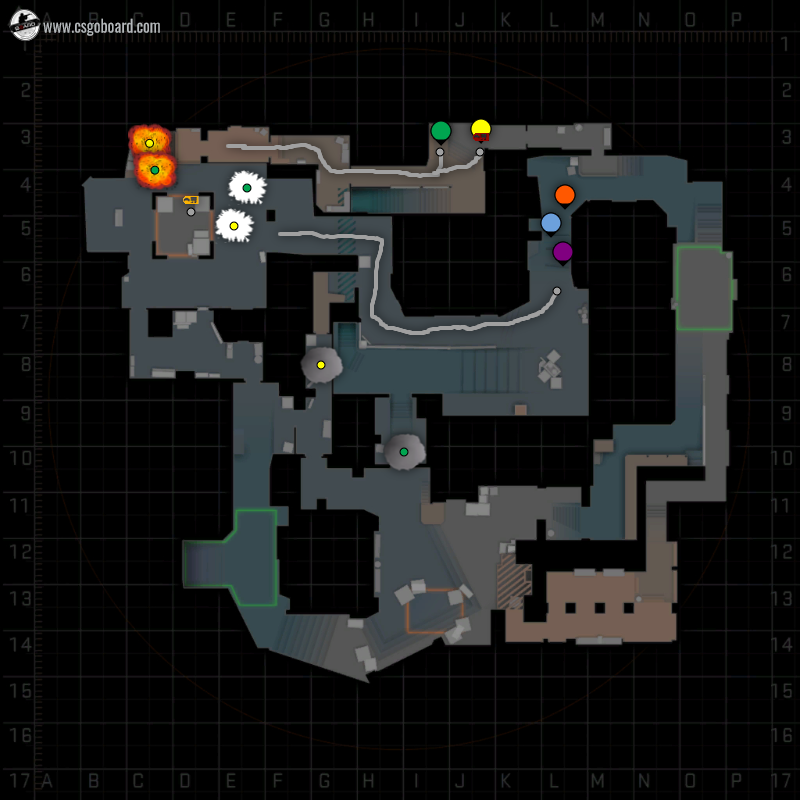

# Buy:
**Green**: smoke, he, flash

**Yellow**: smoke, he, flash

**Orange**: kevlar

**Blue**: kevlar

**Violet**: kevlar

# Execute:

1. Orange, Blue and Violet go to mid like in the picture. Yellow and Green go to Aps. 
2. Green smoke connector and Yellow smoke window. 
3. The mid guys push short. 
4. Before the mid guys reach B Green and Yellow use their flash. 
5. The mid players conquer B. The Aps player double nade van. 
6. Plant the bomb.

